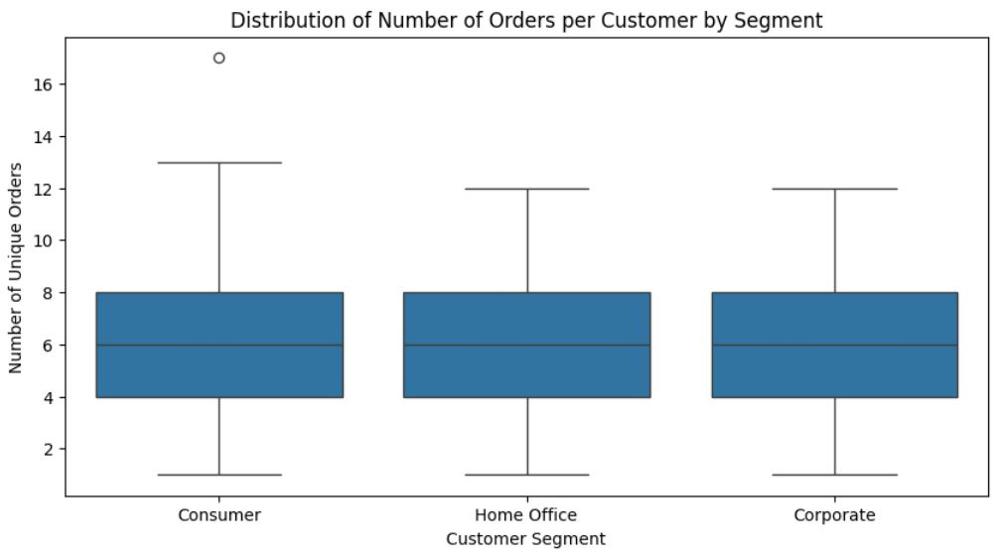

# 📊 Customer Segmentation and Pricing Strategy Optimization

This project analyzes a sales dataset to uncover trends in customer behavior across different segments, optimize pricing strategies, and improve overall profitability. The dataset includes order details, customer information, product categories, sales, and shipment data.

---

## 📁 Dataset Overview

The dataset (`dataset.csv`) contains the following key columns:

- **Order_Date, Ship_Date**: Used to calculate lead time
- **Sales**: Revenue per transaction
- **Segment**: Customer group (`Consumer`, `Corporate`, `Home Office`)
- **Category**: Product category (`Furniture`, `Office Supplies`, `Technology`)
- **Region/State**: For geographic analysis
- **Discount**: Estimated from industry benchmarks
- **Profit**: Calculated based on average profit margin per category

---

## ⚙️ Data Processing Steps

- Cleaned and parsed mixed-format dates using logical constraints  
- Calculated **Lead Time** as the difference between `Ship_Date` and `Order_Date`  
- Estimated **Discount** and **Profit** using the following category-based assumptions:

| Category         | Avg. Discount | Avg. Profit Margin |
|------------------|---------------|--------------------|
| Furniture         | 17.39%        | 12.50%             |
| Office Supplies   | 22.15%        | 8.75%              |
| Technology        | 5.20%         | 25.30%             |

---

## 🔍 Key Insights

- 🔻 **Higher discounts did not improve sales** across any customer segment.
- 📉 **Profitability declined** with increased discounts, especially in the Home Office segment.
- 💼 The **Consumer segment** had the highest number of orders and revenue, but the **lowest profit per item**.
- 🧾 The **Home Office segment** generated the **highest profit margin**, suggesting price resilience.

---

## 📷 Visual Insights

### Sales, Profit & Avg. Discount by Segment

---

### Profit Margin by Segment

---

### Discount vs Sells and Profit Correlation

---

### Order Distribution based on Segment

---

## 🎯 Recommendation 1: Implement Targeted, Controlled Discounts for the Consumer Segment on Office Supplies

### Justification:
- The **Consumer** segment has the **highest number of items ordered overall (5,101)**, and **Office Supplies alone account for 3,072 items** (≈60% of their volume).
- Their **average profit per item is only $35.55**, indicating thinner margins due to possibly unnecessary discounts.
- **Scatterplot analysis** shows no meaningful increase in sales with higher discounts, but a **clear decline in profit**.

### Strategy:
- Apply **targeted discounts (5–10%)** only on high-volume Office Supplies, not across all products.
- **Bundle frequently purchased items** (e.g., pens + paper) to increase average transaction size while limiting margin loss.
- Use **purchase history** to personalize discounts, avoiding broad promotions that damage profitability.

---

## 💼 Recommendation 2: Adopt Premium Pricing Strategy for the Home Office Segment, Especially in Technology

### Justification:
- The **Home Office** segment has the **highest average profit per item (\$41.18)** and **highest average sales per item (\$243.40)** but **lowest volume (1,746 items)**.
- They order **very few Technology items (only 335)** compared to other segments.
- Analysis shows that **higher discounts correlate strongly with profit loss**, and **Home Office buyers do not increase purchases with discounts**.

### Strategy:
- **Stop offering general discounts** for this segment.
- Instead, introduce **premium bundles** or **value-added service tiers** (e.g., setup support, warranty, faster delivery).
- Encourage Tech adoption by offering **exclusive access or limited-time “premium packs”** — not through price cuts.

---

## 📈 Tools & Technologies

- Python (Pandas, Seaborn, Matplotlib, Plotly)
- Jupyter Notebook
- Data parsing via `dateutil`
- Correlation and group analysis

---

## ✨ Author

**Tanvir Taushif**  
📧 tanvirpial9961@gmail.com  
🔗 [LinkedIn](https://linkedin.com/in/tanvir-taushif) | [GitHub](https://github.com/yourusername)

---

